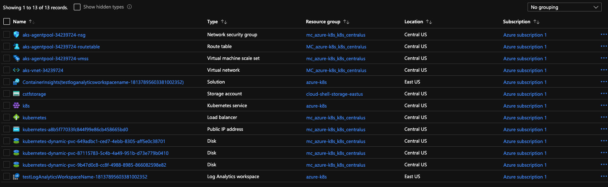

# Nginx websever with Prometheus and Grafana

This repo contains everything you need to deploy a kubernetes cluster in Azure, deploy Prometheus and Grafana as well deploy an Nginx Ingress controller so we can access all of our services. This guide was done on Mac OS but can be done on other platforms as well.

To keep this README from being too long I have created separate README's. There is one in the tf-deploy directory that shows how to create our kubernetes cluster in Azure. There is another README in the kubernetes directory that explains the deployment of Prometheus, Granana, and Nginx

All of this can easily be automated with Git Actions, Jenkins or any other CI/CD setup but for the interest in the amount of time I had to work on this, I mostly set this up manually with Terraform and CLI.

Here are all the resources that were created in Azure:

