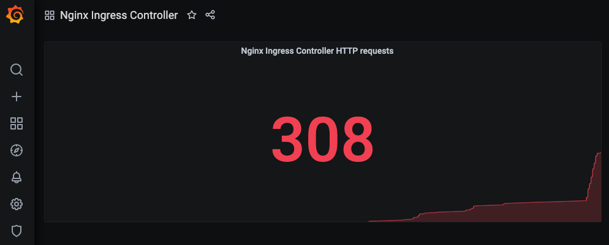

# Deploy Prometheus, Grafana, Nginx-Ingress, and Nginx

In this directory there are configurations for deploying our monitoring apps and our services. I chose to also install the Nginx Ingress controller so that we could access Prometheus and Granfana as well as it already has the prometheus exporter built in. As soon as the Ingress is up, Prometheus will start scraping metrics.

## Prometheus

To install prometheus I am going to use helm. Firt thing is to clone the Helm repo:

`git clone https://github.com/helm/charts.git`

After that I went into the stable charts directory and found Prometheus. Once in there I needed to add the monitoring namespace to our cluster before installing the chart:

`kubectl create namespace monitoring`

Now we are ready to install the prometheus chart but don't forget to also install Helm:

`brew install helm`

`helm install prometheus . --namespace monitoring --set rbac.create=true`

If you get an error about kube-metrics-server, run the following command and then run the install again:

`helm dep update`

You can check to see if things are running with:

`kubectl -n monitoring get all`

## Grafana

Find the grafana directory in the stable charts section and run the following to install grafana:

`helm install grafana . --set persistence.enabled=true --set persistence.accessModes={ReadWriteOnce} --set persistence.size=8Gi --namespace monitoring`

Notice that we are using persistant storage here, we don't want to lose our graphs if the grafana pod is killed.

## Nginx Ingress Controller

We are also going to use helm to install the Ingress controller:

`helm repo add nginx-stable https://helm.nginx.com/stable`

`helm repo update`

`helm install nginx-ingress nginx-stable/nginx-ingress`

After that is installed you will notice something if you run the following command:

`kubectl get svc` (I installed the Ingress in the default namespace but it can be installed in any namespace.)

*nginx-ingress-nginx-ingress   LoadBalancer   10.0.136.47   40.122.36.120   80:32231/TCP,443:32496/TCP   138m*

We now have a Load Balancer in Azure with the IP of 40.122.36.120. We can now create ingresses for all of our services and use our hosts file to map to the Load Balancer IP. To setup the ingresses as well as deploy a vanilla Nginx webserver, go into the kubernetes directory and run the following:

`kubectl apply -f .`

Now edit your /etc/hosts file and add the following:

- 40.122.36.120   prometheus.az.com
- 40.122.36.120   grafana.az.com
- 40.122.36.120   mywebapp.az.com

NOTE: your IP for the Load Balancer will be different, be sure to put your LB IP and not the one I have listed here.

You can update the URLs if you want, just be sure to also change them in the ingress yamls. Lets go to Grafana but first we need the admin password which we can change once we have logged in:

`kubectl get secret --namespace monitoring grafana -o jsonpath="{.data.admin-password}" | base64 --decode ; echo`

In your browser go to grafana.az.com and login with admin as the user and the output of the previous command as the password. Once logged in go to datasources and select Prometheus. In the URL field we need the IP of the Prometheus server. You can get that by running the following:

`kubectl -n monitoring get svc`

You are looking for the CLUSTER-IP for prometheus-server. Enter that into the URL field in grafana and click Save and Test.

Now we can create a graph that shows HTTP requests. The metric we are looking for here is *nginx_ingress_nginx_http_requests_total*.

Now eveytime I reload mywebapp.az.com the grafana graph goes up by 1. NOTE: this will also go up if I hit prometheus UI or grafana UI because prometheus is scrapping the ingress endpoint. There is also a Nginx exporter for Prometheus if we just wanted metrics for the Nginx webserver but it seemed redundant since we already have metrics for the ingress endpoint. Here is an image of the graph:

